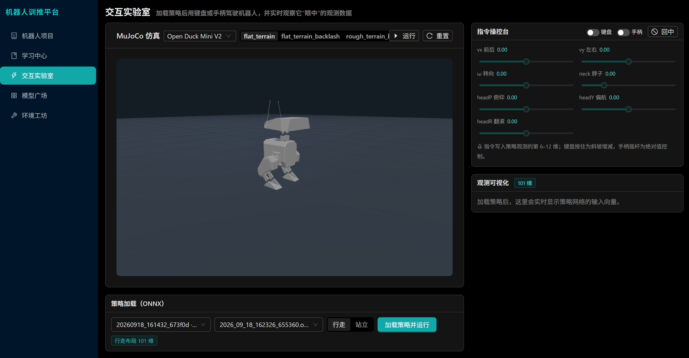
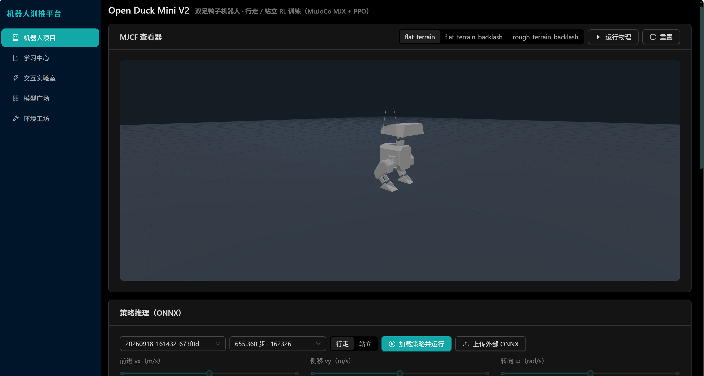
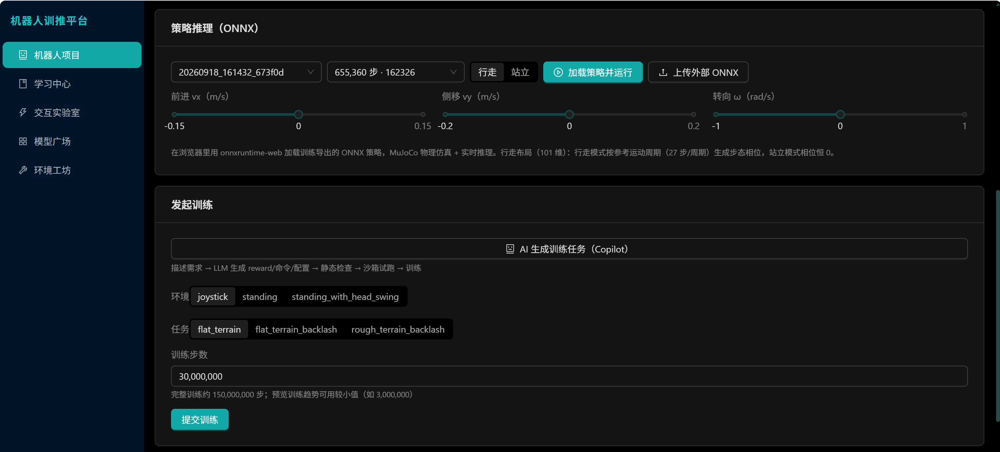
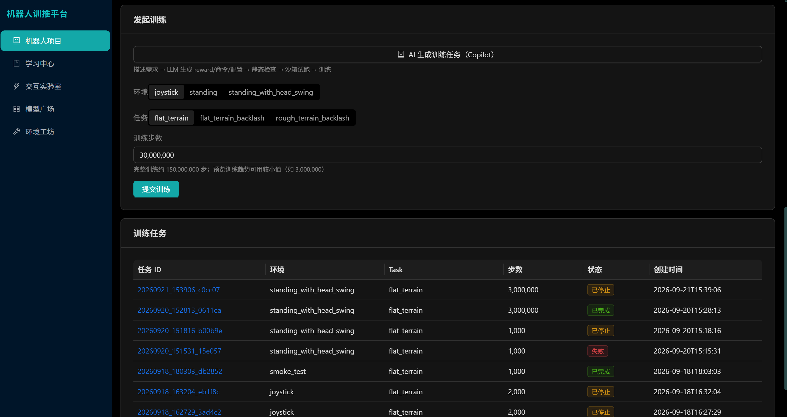
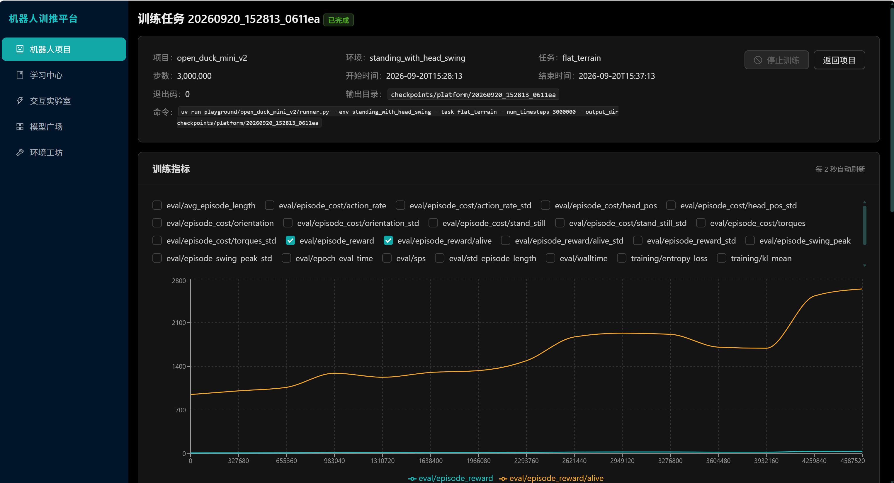
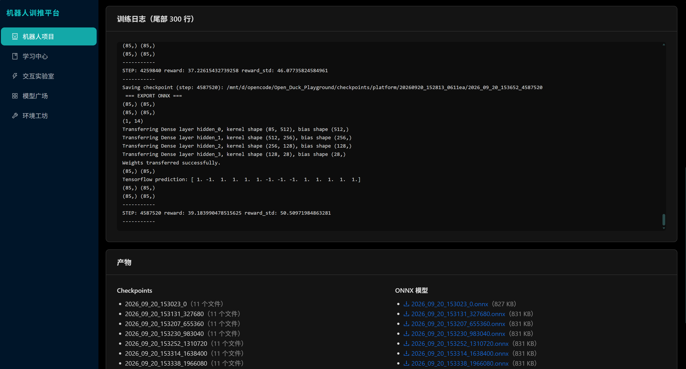
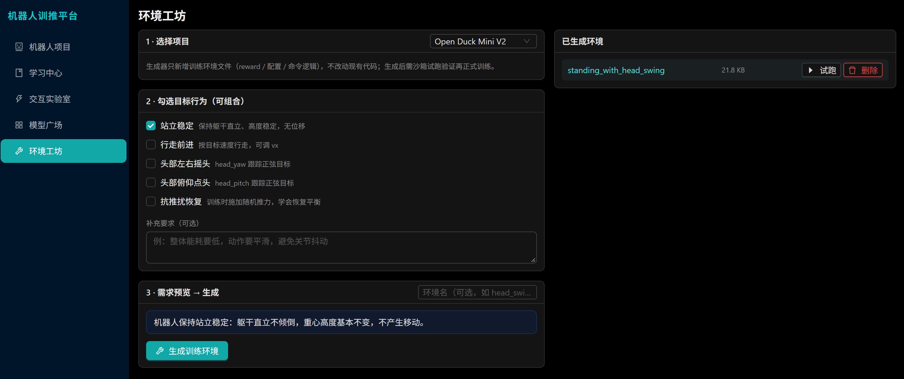
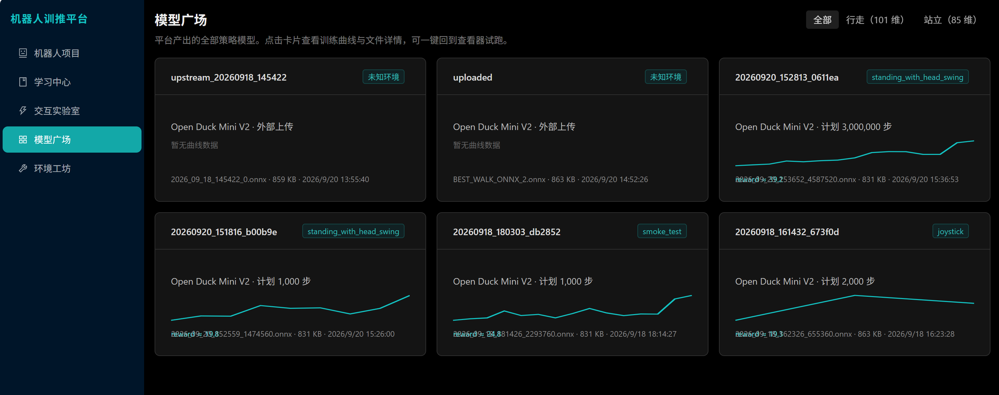
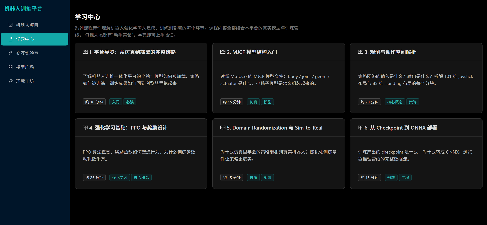

# RoboTI

**RoboTI** = Robot + **T**raining & **I**nference — an open, web-based platform that unifies **robot RL training and inference** in one place: browse MJCF models in 3D, submit and monitor RL training, run trained ONNX policies **directly in the browser**, and generate new training environments with an LLM Copilot.

[](LICENSE)


[中文文档](README.zh-CN.md)

> First adapted robot: **Open Duck Mini V2** (bipedal duck, MuJoCo MJX + PPO).

---

## ✨ Demo — Interactive Lab

Load a model, plug in a trained ONNX policy, and watch the duck walk — all computed locally in your browser (MuJoCo WASM for physics + ONNX Runtime Web for the policy). Drive it with your keyboard or a gamepad.

**[▶️ Watch the demo video](docs/imgs/lab-demo.mp4)**



<!-- TIP: after the repo is public, upload lab-demo.mp4 to a GitHub Release and
     replace the link above with the release asset URL to get inline playback,
     e.g.  -->

## 📸 Screenshots

### Robot project — online MJCF viewer, inference & training in one page



<details>
<summary>More views</summary>

MJCF structure inspection:



Inference replay with a trained policy:



</details>

### Training — submit jobs, watch metrics in real time



<details>
<summary>More views</summary>



</details>

### Workshop — generate custom training environments with LLM

Describe the behavior you want (e.g. *"stand while swinging the head, head_yaw tracking a 0.5 Hz sine"*) and the Copilot writes the environment code, validates it in three static stages, shows you a diff for review, then lets you launch a sandbox run or a full training with one click.



### Model hub — all your trained & uploaded policies



### Learn — RL training knowledge base



## 🧩 Features

- **Browser-side MJCF viewer & simulation** — MuJoCo WASM + Three.js render and simulate the robot model entirely in the browser (no server-side rendering needed).
- **Browser-side policy inference** — trained ONNX policies run via ONNX Runtime Web; interactive control via keyboard/gamepad in the **Interactive Lab**.
- **RL training management** — submit / monitor / stop jobs; a custom TensorBoard event parser (no TensorFlow dependency) streams metrics to the frontend; checkpoints and ONNX exports are organized per job.
- **Training process survives backend restarts** — jobs run under `systemd-run --user` in WSL, detached from the backend lifecycle; the backend re-attaches monitoring automatically.
- **LLM Copilot (template-constrained generation)** — the LLM only writes *new* environment files (rewards / config / command logic) following a strict skeleton; three-stage static checks (syntax → import → environment instantiation); diff review UI before anything runs.
- **Non-invasive robot adapters** — plug in a new robot sub-project by dropping a single YAML file (training command template + MJCF dir + env/task list). No changes to the sub-project code.
- **Model hub** — upload external ONNX files or pick any trained run, then jump straight into the Lab for a test drive.

## 🏗️ Architecture

```
Browser
 ├─ React + Ant Design (Vite, TypeScript)
 ├─ MuJoCo WASM — in-browser physics
 └─ Three.js — MJCF rendering
        │ /api/* (JSON / zip / file download)
        ▼
FastAPI backend
 ├─ adapters/*.yaml — robot sub-project descriptors (non-invasive)
 ├─ Training jobs — managed via systemd-run --user inside WSL
 ├─ Metrics — custom TensorBoard event parser (no TensorFlow)
 ├─ LLM Copilot — template-constrained env generation + 3-stage checks
 └─ Job/log/artifact APIs + static hosting of the built frontend
        │ wsl.exe
        ▼
WSL Ubuntu (uv + JAX/MJX training environment)
 └─ uv run playground/<project>/runner.py --env … --task … --output_dir checkpoints/<job_id>
```

## 🚀 Getting Started

### Prerequisites

- **Windows 10/11 + WSL2** (Ubuntu-22.04 recommended, systemd enabled) — training runs inside WSL
- [uv](https://docs.astral.sh/uv/) — Python package manager (both Windows & WSL sides)
- **Node.js ≥ 18** — frontend build
- A robot sub-project to train — see [Open_Duck_Playground](https://github.com/apirrone/Open_Duck_Playground) (the first adapted project)

### Layout

RoboTI talks to sub-projects through adapters that point to a sibling directory:

```
parent/
├── RoboTI/                  # this repo
└── Open_Duck_Playground/    # robot sub-project (clone next to RoboTI)
```

### 1. Backend

```bash
cd RoboTI/backend
uv sync
# copy the example config and edit as needed
cp ../platform.example.yaml ../platform.yaml
uv run uvicorn app.main:app --reload --port 8000
```

> The backend serves the API at `http://127.0.0.1:8000`. In production mode (after `npm run build`), it also hosts the built frontend.

### 2. Frontend

```bash
cd RoboTI/frontend
npm install
npm run dev        # http://localhost:5173, proxies /api to the backend
```

The MuJoCo / ONNX Runtime wasm files are copied into `public/` automatically at dev/build time.

### 3. Training environment (WSL)

Inside WSL, set up the training stack of your sub-project (for Open_Duck_Playground: `uv` + JAX/MJX). Training jobs are launched via `wsl.exe` and managed by systemd user units.

### 4. (Optional) Enable the LLM Copilot

Edit `platform.yaml` — any OpenAI-compatible API works (GLM / DeepSeek / Kimi / …):

```yaml
llm:
  base_url: "https://open.bigmodel.cn/api/paas/v4"
  api_key: "<your-api-key>"
  model: "glm-4.6"
```

Restart the backend. Without LLM config, every other feature still works.

## 🤖 Adding a New Robot

Drop a single YAML into `adapters/`:

```yaml
name: my_robot
display_name: My Robot
repo_root: ".."                                   # sub-project location, relative to RoboTI
xmls_dir: playground/my_robot/xmls                # MJCF assets
reference_motion: playground/my_robot/data/xx.pkl # optional, for imitation rewards
train_command: >-                                 # filled by the platform
  uv run playground/my_robot/runner.py --env {env} --task {task}
  --num_timesteps {num_timesteps} --output_dir {output_dir}
envs:
  joystick: [flat_terrain]
```

No changes to the robot sub-project are required — the platform scans the adapter directory at startup.

## 🗺️ Roadmap

- [x] Browser MJCF viewer + MuJoCo WASM simulation
- [x] RL training management & real-time metrics
- [x] Browser-side ONNX inference & interactive Lab
- [x] LLM Copilot for environment generation
- [x] Model hub & learn center
- [ ] Server-side rollout → video-stream replay fallback
- [ ] Docker / one-click deployment, multi-user support
- [ ] More robots out of the box (second adapter)

## 🙏 Acknowledgements

- [Open_Duck_Playground](https://github.com/apirrone/Open_Duck_Playground) — the first adapted robot sub-project (and a great RL-for-robots playground)
- [mujoco_playground](https://github.com/kscalelabs/mujoco_playground) — inspiration
- [MuJoCo](https://mujoco.org/) / [MJX](https://github.com/google-deepmind/mujoco), [ONNX Runtime Web](https://onnxruntime.ai/), [Three.js](https://threejs.org/), [FastAPI](https://fastapi.tiangolo.com/)

## License

[MIT](LICENSE)
